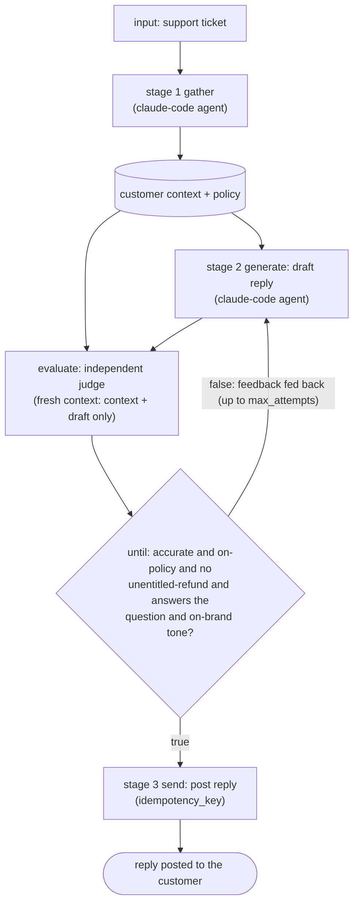

# AWF: Agentic Workflow Format

A runtime for **agentic pipelines**: you write author-defined control flow whose steps are
black-box agent CLIs (such as Claude Code) and shell commands, run against long-lived containers,
with an independent judge (the **gate**) checking every stage. It is one Go binary, `awf`.

Think of it as **TDD for agent workflows**: you write the acceptance check, the runtime runs it,
and a stage advances only when the check passes. The agent never marks its own homework.

## Why it exists

Nondeterministic agent steps report success they didn't achieve. A coding agent says the tests pass
when they actually error out; a data job reports a clean migration after quietly dropping rows; a
research step cites a source that doesn't say what it claims. The agent usually can't catch this
itself: Huang et al. found that large language models ["cannot self-correct reasoning
yet"][selfcorrect] without external feedback, and sometimes get *worse* when they try.

So correctness has to be checked from the outside. Anthropic's ["Building Effective
Agents"][anthropic] describes the **evaluator-optimizer** workflow: one model generates, a second
evaluates and feeds critique back in a loop. AWF makes that pattern a first-class primitive (the
gate) and adds the guarantee a self-grading loop can't have: the evaluator is *structurally
independent* of the generator (a fresh context, or a deterministic check). The verdict is never the
generator's own self-report. That matters: models favor their own outputs [selfpref], and
self-refinement *amplifies* that bias instead of fixing it [selfbias], so an independent critic
(ideally a different model) checks the work far more reliably than the generator can check itself.

Everything else in AWF exists to serve that check: long-lived containers (the test needs a real
system to run against), typed outputs (so the check reads validated fields, not fragile text), and
content-addressed checkpoint/resume (so an expensive agent run is never redone after a crash).

## Getting started

Requirements: Go 1.26+, and Docker for the isolated container backend.

```sh
make build      # builds ./bin/awf
make man        # optional: build the man pages (then: man ./man/awf.1, man ./man/awf-workflow.5)
```

## A first workflow

Three stages that compose into one task: answer a customer support ticket safely. An agent gathers
the customer's account context, a second agent drafts a reply, and an *independent* LLM judge checks
that reply against the account and your policy before it is ever sent. The judge is the gate, so the
agent that wrote the reply never decides whether it is safe to send.

```yaml
workflow: support-reply
version: 1

input:
  type: object
  required: [ticket_id]
  properties:
    ticket_id: { type: string }

containers:
  desk:
    image: oci://registry.example.com/support-runner@sha256:...   # digest-pinned, not a tag

graph:
  # stage 1: gather the customer's account + order context and the relevant policy
  - id: gather
    container: desk
    uses: anthropic/claude-code
    with: { skill: support-context, ticket: "{{ input.ticket_id }}" }
    output_files: [/out/context.json]
    output_schema:
      type: object
      additionalProperties: false
      required: [context_path]
      properties: { context_path: { type: string } }

  # stage 2: draft a reply, judged for accuracy + policy by an independent LLM, repaired until it passes
  - gate:
      generate:
        - id: draft
          container: desk
          uses: anthropic/claude-code
          with: { skill: support-reply, context: "{{ step.gather.context_path }}" }
          output_files: [/out/reply.md]
          output_schema:
            type: object
            additionalProperties: false
            required: [reply_path]
            properties: { reply_path: { type: string } }
      evaluate:
        # fresh context: sees the customer context and the draft, never the writer's reasoning
        - id: judge
          container: desk
          uses: anthropic/claude-code
          with: { skill: support-reply-judge, context: "{{ step.gather.context_path }}", reply: "{{ step.draft.reply_path }}" }
          output_schema:
            type: object
            additionalProperties: false
            required: [accurate, on_policy, promises_unentitled_refund, answers_the_question, on_brand_tone, feedback]
            properties:
              accurate:                   { type: boolean }
              on_policy:                  { type: boolean }
              promises_unentitled_refund: { type: boolean }
              answers_the_question:       { type: boolean }
              on_brand_tone:              { type: boolean }
              feedback:                   { type: string }
      until: "{{ evaluate.accurate && evaluate.on_policy && !evaluate.promises_unentitled_refund && evaluate.answers_the_question && evaluate.on_brand_tone }}"
      max_attempts: 4

  # stage 3: post the approved reply to the help desk, idempotently (never double-send)
  - id: send
    container: desk
    run: ./send-reply.sh "{{ input.ticket_id }}" /out/reply.md
    idempotency_key: "{{ input.ticket_id }}:reply"
```

The data flow (three stages, with the gate's repair loop in the middle):



Run it:

```sh
bin/awf validate ./support-reply.yaml              # parse + check it is well-formed
bin/awf run --backend docker ./support-reply.yaml  # execute; --backend docker so it can resume
```

Why this is more than a "have an agent answer tickets" script: the middle stage is an independent
LLM judge that re-reads the draft against the customer's actual account and your policy, making the
call no keyword check can (is every claim accurate, does it quietly promise a refund the customer is
not entitled to, does it answer the question, is the tone on-brand). The agent that wrote the reply
never decides whether it is safe to send; a fresh-context judge does, and on a fail its findings
feed back so the next draft is conditioned on the critique, up to `max_attempts`. The three stages
compose through typed outputs and the shared workspace, the approved reply is posted idempotently so
a retry never double-sends, and each committed stage is checkpointed so a crash never re-pays for
finished agent work.

## Documentation

- **`awf(1)`** ([`man/awf.1.md`](man/awf.1.md)): the command reference, covering what each command
  does, its flags, exit codes, and examples.
- **`awf-workflow(5)`** ([`man/awf-workflow.5.md`](man/awf-workflow.5.md)): the workflow-format
  reference, covering top-level fields, the three step types, control flow and the gate, templating,
  and checkpoint/resume.
- [`docs/runtime-design.md`](docs/runtime-design.md): the implementation design.

## Further reading

- Anthropic, [*Building Effective Agents*][anthropic] (2024): the evaluator-optimizer pattern AWF
  builds in as the gate.
- Huang et al., [*Large Language Models Cannot Self-Correct Reasoning Yet*][selfcorrect] (ICLR
  2024): why the evaluator has to be independent of the generator.
- Xu et al., [*Pride and Prejudice: LLM Amplifies Self-Bias in Self-Refinement*][selfbias] (2024):
  self-critique amplifies a model's own bias; external feedback is what reduces it.
- Panickssery et al., [*LLM Evaluators Recognize and Favor Their Own Generations*][selfpref] (2024):
  models recognize and prefer their own outputs, so an independent (ideally different-model) judge
  is a less biased check.

[anthropic]: https://www.anthropic.com/research/building-effective-agents
[selfcorrect]: https://arxiv.org/abs/2310.01798
[selfbias]: https://arxiv.org/abs/2402.11436
[selfpref]: https://arxiv.org/abs/2404.13076
