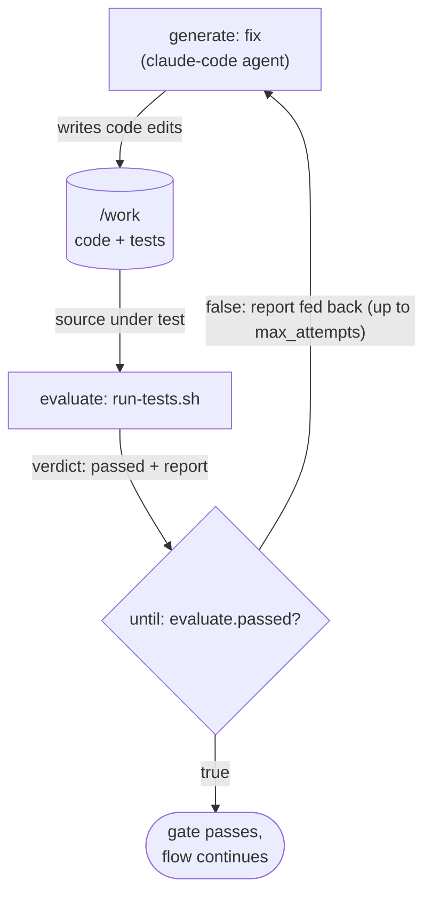

# AWF: Agentic Workflow Format

A runtime for **agentic pipelines**: you write author-defined control flow whose steps are
black-box agent CLIs (such as Claude Code) and shell commands, run against long-lived containers,
with an independent judge (the **gate**) checking every stage. It is one Go binary, `awf`.

Think of it as **TDD for agent workflows**: you write the acceptance check, the runtime runs it,
and a stage advances only when the check passes. The agent never marks its own homework.

## Why it exists

Nondeterministic agent steps report success they didn't achieve. A coding agent says the tests pass
when they actually error out; a data job reports a clean migration after quietly dropping rows; a
research step cites a source that doesn't say what it claims. The agent usually can't catch this
itself: Huang et al. found that large language models ["cannot self-correct reasoning
yet"][selfcorrect] without external feedback, and sometimes get *worse* when they try.

So correctness has to be checked from the outside. Anthropic's ["Building Effective
Agents"][anthropic] describes the **evaluator-optimizer** workflow: one model generates, a second
evaluates and feeds critique back in a loop. AWF makes that pattern a first-class primitive (the
gate) and adds the guarantee a self-grading loop can't have: the evaluator is *structurally
independent* of the generator (a fresh context, or a deterministic check). The verdict is never the
generator's own self-report. That matters: models favor their own outputs
[selfpref], and self-refinement *amplifies* that bias instead of fixing it
[selfbias], so an independent critic (ideally a different model) checks the work
far more reliably than the generator can check itself.

Everything else in AWF exists to serve that check: long-lived containers (the test needs a real
system to run against), typed outputs (so the check reads validated fields, not fragile text), and
content-addressed checkpoint/resume (so an expensive agent run is never redone after a crash).

## Getting started

Requirements: Go 1.26+, and Docker for the isolated container backend.

```sh
make build      # builds ./bin/awf
make man        # optional: build the man pages (then: man ./man/awf.1, man ./man/awf-workflow.5)
```

## A first workflow

Here is the whole idea in one file: hand a coding agent a failing test suite and let it fix the
code, but only call it done when the tests *actually* pass. The test run is the gate, so the agent
cannot declare victory on its own.

```yaml
workflow: fix-the-tests
version: 1

containers:
  dev:
    # an image that ships the kata: a failing test plus a stub to implement
    image: oci://docker.io/library/python:3.12@sha256:...   # digest-pinned, not a tag

graph:
  - gate:
      generate:
        - id: fix
          container: dev
          uses: anthropic/claude-code
          with:
            prompt: >
              The test suite under /work is failing. Fix the code so the tests
              pass. Do not edit the tests themselves.
            # on each repair attempt the previous failing output is fed in automatically
      evaluate:
        - id: tests
          container: dev
          run: ./run-tests.sh        # runs the suite; writes {"passed":bool,"report":string} to $AWF_OUTPUT
          output_schema:
            type: object
            additionalProperties: false
            required: [passed, report]
            properties:
              passed: { type: boolean }
              report: { type: string }
      until: "{{ evaluate.passed }}"
      max_attempts: 4
```

The gate's data flow (generate, evaluate, repair until the real tests pass):



Run it:

```sh
bin/awf validate ./fix-the-tests.yaml              # parse + check it is well-formed
bin/awf run --backend docker ./fix-the-tests.yaml  # execute; --backend docker so it can resume
```

Why this is more than a "please fix my tests" script: the **evaluate** block runs the real suite as
an *independent* judge, so a confident "I fixed it" is never taken on faith. When the tests still
fail, that output is fed back into the next attempt automatically, and AWF repairs up to
`max_attempts` times before giving up. If the machine dies mid-run, `awf resume` replays the work
already committed instead of paying for the agent again. Launching a whole agent CLI as a black-box
step, gating it with an independent check, and checkpointing the expensive parts is the combination
AWF puts together that other tools do not.

## Documentation

- **`awf(1)`** ([`man/awf.1.md`](man/awf.1.md)): the command reference, covering what each command
  does, its flags, exit codes, and examples.
- **`awf-workflow(5)`** ([`man/awf-workflow.5.md`](man/awf-workflow.5.md)): the workflow-format
  reference, covering top-level fields, the three step types, control flow and the gate, templating,
  and checkpoint/resume.
- [`docs/runtime-design.md`](docs/runtime-design.md): the implementation design.

## Further reading

- Anthropic, [*Building Effective Agents*][anthropic] (2024): the evaluator-optimizer pattern AWF
  builds in as the gate.
- Huang et al., [*Large Language Models Cannot Self-Correct Reasoning Yet*][selfcorrect] (ICLR
  2024): why the evaluator has to be independent of the generator.
- Xu et al., [*Pride and Prejudice: LLM Amplifies Self-Bias in Self-Refinement*][selfbias] (2024):
  self-critique amplifies a model's own bias; external feedback is what reduces it.
- Panickssery et al., [*LLM Evaluators Recognize and Favor Their Own Generations*][selfpref] (2024):
  models recognize and prefer their own outputs, so an independent (ideally different-model) judge
  is a less biased check.

[anthropic]: https://www.anthropic.com/research/building-effective-agents
[selfcorrect]: https://arxiv.org/abs/2310.01798
[selfbias]: https://arxiv.org/abs/2402.11436
[selfpref]: https://arxiv.org/abs/2404.13076
