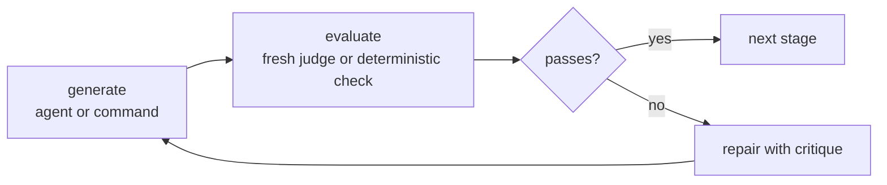

# AWF

[](https://github.com/valbaudo/awf/actions/workflows/ci.yml) [](https://goreportcard.com/report/github.com/valbaudo/awf) [](https://pkg.go.dev/github.com/valbaudo/awf) [](https://go.dev/) [](LICENSE)

AWF is a single-binary runtime for agentic workflows that need a real acceptance
gate: run the agent, check the result independently, repair from the critique,
and resume safely after crashes without redoing committed work.

It is built for workflows where a model saying "done" is not good enough:
coding agents, research agents, data-migration agents, support-reply agents,
security triage agents, or any pipeline where each stage should advance only
after an external check passes.

[CLI reference](man/awf.1.md) | [Workflow format](man/awf-workflow.5.md)

## Why AWF Exists

Agentic workflows are useful because they let models do open-ended work. They
are risky for the same reason: the step can report success without actually
meeting the requirement.

AWF makes the acceptance check part of the runtime.



The central primitive is the **gate**: a generate block, an independent evaluate
block, an `until` condition over the evaluator's typed output, and a bounded
repair loop. The evaluator runs in a fresh context, so the generator never marks
its own homework. A crash is not a verdict; only a real evaluation with a false
`until` consumes a repair attempt.

## What You Get

- **Independent gates**: engine-enforced generate -> evaluate -> repair loops,
  with the prior verdict automatically fed into the next generate attempt.
- **Black-box agents**: wrap existing CLIs such as Claude Code, Factory droid,
  Block Goose, OpenAI Codex, or use `awf/llm` for direct OpenAI-compatible HTTP.
- **Typed outputs**: downstream steps bind to validated `output_schema` fields,
  not fragile free text.
- **Checkpoint/resume**: step outputs and declared files commit to a
  content-addressed artifact store before the journal pointer moves.
- **Pinned replay**: resume hard-fails if the workflow definition, imported
  files, assets, container digests, or resolved runtime versions drift.
- **Real workspaces**: run against long-lived native processes, digest-pinned
  containers, or Compose labs; Docker handles networking, healthchecks, and
  multi-service wiring.
- **Traceable runs**: inspect runs, fold status from the log, and export traces
  without putting observability in the execution path.

## A First Workflow

This workflow asks a model to write a release note, then has an independent
judge approve it or send feedback into the next repair attempt.

```yaml
workflow: gated-release-note
version: 1

graph:
  - gate:
      generate:
        - id: draft
          uses: awf/llm
          with:
            base_url: http://localhost:11434/v1
            model: llama3.1
            api_key_env: OPENAI_API_KEY
            system_prompt: "You write concise release notes."
            prompt: |
              Write a three-sentence release note for a new `awf run --json` flag.
              Prior review feedback, if any: {{ evaluate.feedback }}
          output_schema:
            type: object
            additionalProperties: false
            required: [release_note]
            properties:
              release_note: { type: string }

      evaluate:
        - id: judge
          uses: awf/llm
          with:
            base_url: http://localhost:11434/v1
            model: llama3.1
            api_key_env: OPENAI_API_KEY
            system_prompt: "You are a strict release-note reviewer."
            prompt: |
              Review this release note:

              {{ step.draft.release_note }}

              Approve it only if it is accurate, specific, and exactly three sentences.
          output_schema:
            type: object
            additionalProperties: false
            required: [approved, feedback]
            properties:
              approved: { type: boolean }
              feedback: { type: string }

      until: "{{ evaluate.approved }}"
      max_attempts: 3
```

That same shape works for higher-stakes tasks: generate a patch and run tests,
draft a customer reply and judge it against account data, triage a CVE and check
the exploitability claim, or migrate data and verify the target state.

## Quickstart

AWF is a Go 1.26 CLI. Build the binary:

```sh
git clone https://github.com/valbaudo/awf.git
cd awf
make build
```

Validate a workflow without running agents, containers, or network I/O:

```sh
bin/awf validate examples/awf-llm-ollama/workflow.yaml
```

Run the local Ollama example after starting an OpenAI-compatible Ollama server
and forwarding an API-key env var. Ollama can ignore the bearer value; AWF still
requires the named env var to be present because adapters never inline secrets
into workflow files.

```sh
export OPENAI_API_KEY=ollama
bin/awf run examples/awf-llm-ollama/workflow.yaml
```

Use Docker when you want resumable runs or workflows that need isolated
containers/Compose labs:

```sh
bin/awf run --backend docker path/to/workflow.yaml
bin/awf resume <run-id> path/to/workflow.yaml
```

Useful development checks:

```sh
make lint test        # pre-commit bar
make build            # build ./bin/awf
make integ            # Docker/native integration suite; no live API spend
```

## How AWF Is Different

| Concern | Common agent framework shape | AWF shape |
| --- | --- | --- |
| Model execution | Framework calls the model in-process | Runtime wraps external CLIs or one HTTP LLM call as black boxes |
| Quality check | Author wires evaluator nodes or post-hoc evals | Engine owns the independent gate and repair loop |
| State | Mutable snapshots or app-managed memory | Append-only journal plus content-addressed artifacts |
| Resume | Recompute, restore app state, or apply latest definition | Replay committed steps, rerun only the uncommitted frontier |
| Drift | Often latest-wins | Definition digest and runtime versions are pinned; drift is a hard error |
| Infra | Usually in-process or platform-owned workers | Single-host native/Docker/Compose workspaces, rebuilt from pinned recipes |

AWF is not trying to be a distributed scheduler, a durable-execution platform,
or a general agent-team framework. It is a narrow runtime for single-host,
checkpointed agentic pipelines where every meaningful stage has to pass an
independent check before the workflow can move on.

## Core Concepts

- **Workflow**: a YAML document with input schema, optional assets/imports,
  execution infrastructure, and a graph of steps/control flow. The resolved
  document is content-addressed at run start.
- **Step**: a `run:` command, `uses:` agent invocation, `await` signal, or
  imported workflow call. Steps can produce typed JSON outputs and named output
  files.
- **Gate**: a control node that runs generate steps, evaluates them
  independently, checks `until`, and repairs with feedback until the condition
  passes or `max_attempts` is exhausted.
- **Commit**: the durable unit of progress. AWF writes typed outputs, declared
  files, and optional workspace snapshots to the blob store first; only then
  does it append the completed journal event.
- **Resume**: a fold over the journal. Completed steps are replayed from
  committed artifacts; only the uncommitted frontier re-executes. Changed
  definitions or runtime versions stop the resume instead of silently adapting.

## Adapters and Backends

Agent steps name a runtime with `uses:`. The step's `with:` map is opaque to the
engine; only the named adapter validates and interprets it.

Built-in adapters:

- `anthropic/claude-code`
- `factory/droid`
- `block/goose`
- `openai/codex`
- `awf/llm` for OpenAI-compatible Chat Completions endpoints, including local
  Ollama, vLLM, llama.cpp, LM Studio, LiteLLM, and Bifrost-style gateways
- `openai/codex-live` for Codex app-server-backed live sessions

The `openai/codex-live` adapter uses the same `uses:` resolution, runtime
pinning, live event stream, trace, and UI surfaces as other agent steps. It
stores provider session metadata under the live home and keeps raw live
transcripts provider-owned. `block/goose-live` remains a reserved implementation
track ref, and `anthropic/claude-code-live` remains deferred behind a PTY proof
spike.

Execution backends:

- `native`: host processes, fastest path, no isolation; resumable (`snapshot: workspace` workdirs are restored on resume). Explicit `--backend native` runs image-mode workflows on the host, ignoring the declared image; the host base environment is not pinned — use `--backend docker` for a fully reproducible baseline
- `docker`: digest-pinned images and Compose projects, resumable
- `fake`: in-memory backend for conformance tests

See [awf(1)](man/awf.1.md) for adapter environment variables, streaming notes,
security caveats, and CLI flags.

## Documentation

- [awf(1)](man/awf.1.md): command reference, flags, exit status, environment,
  tracing, and examples.
- [awf-workflow(5)](man/awf-workflow.5.md): the workflow-format reference and
  stable contract for fields, control flow, templating, typed outputs, and
  checkpoint/resume.
- [examples/](examples/): runnable examples for `awf/llm`, droid BYOK, and
  engine-owned conversation threads.

## Further Reading

These are the sources AWF actually draws from. The list is intentionally narrow.

### Runtime foundations

- Anthropic, [Building Effective Agents][anthropic]: simple, composable
  workflows; prompt chaining with gates; evaluator-optimizer loops; and the
  "use the simplest architecture that works" bias behind AWF's small core.
- Anthropic, [Effective Context Engineering for AI Agents][contexteng]:
  context as a finite resource; AWF's evaluator runs in a fresh context, while
  explicit typed outputs and artifacts carry the state that should survive.
- Anthropic, [How we built our multi-agent research system][multiagent]:
  shaped AWF's shipped coordinator primitives: artifact handoff, fan-out/fan-in,
  reusable agent roles, engine-owned conversation threads, and keyed signals.
  AWF coordinates black-box agents rather than implementing Anthropic's dynamic
  subagent planner.
- Huang et al., [Large Language Models Cannot Self-Correct Reasoning Yet][selfcorrect]:
  one reason AWF makes evaluation external to the generator.
- Xu et al., [Pride and Prejudice: LLM Amplifies Self-Bias in Self-Refinement][selfbias]:
  why self-refinement is not the same as independent review.
- Panickssery et al., [LLM Evaluators Recognize and Favor Their Own Generations][selfpref]:
  why model self-preference matters when designing a judge.
- Zheng et al., [SkillRouter: Skill Routing for LLM Agents at Scale][skillrouter]:
  the foundation for AWF's native skill-routing primitive. AWF adopts the
  paper's lesson that routing needs the full skill body, not only names or
  frontmatter; BM25 is the default plug-and-play router so local skill libraries
  start useful immediately, while model-backed routing remains a stronger option
  when teams want to trade cost and complexity for accuracy.

[anthropic]: https://www.anthropic.com/engineering/building-effective-agents
[contexteng]: https://www.anthropic.com/engineering/effective-context-engineering-for-ai-agents
[multiagent]: https://www.anthropic.com/engineering/multi-agent-research-system
[skillrouter]: https://arxiv.org/abs/2603.22455
[selfcorrect]: https://arxiv.org/abs/2310.01798
[selfbias]: https://arxiv.org/abs/2402.11436
[selfpref]: https://arxiv.org/abs/2404.13076
